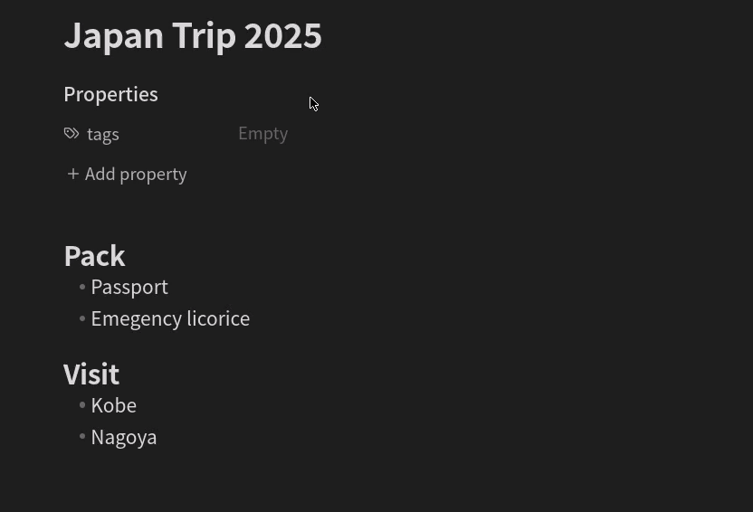

# Frontmatter to HTML Attributes

An Obsidian plugin that makes a note’s YAML frontmatter available in HTML as data-* attributes for metadata based CSS styling.



## Examples

With the plugin installed, you can use CSS snippets like below

1. Display an island icon with the title of every note tagged "travel".
    ```css
    div.workspace-leaf-content[data-tags*='"travel"'] div.inline-title:after {
      content: " \1F3DD\FE0F"; /** 🏝️ */
    }
    ```
2. Underline headings in notes with the "sections" attribute checked.
    ```css
    div.workspace-leaf-content[data-sections="true"] .HyperMD-header-1, /** editing mode */
    div.workspace-leaf-content[data-sections="true"] h1 { /** reading mode */
      border-bottom: dashed 2px var(--interactive-accent); 
    }
    ```

## Usage

For every item in the YAML frontmatter `<foo>`, an equivalent attribute `data-<foo>` is added to the note’s HTML container `div.workspace-leaf-content`. To style notes based on these attributes, create CSS snippets using [attribute selectors](https://developer.mozilla.org/en-US/docs/Web/CSS/Attribute_selectors).

To match a YAML frontmatter item XXX with value YYY, create a CSS rule for the attribute data-XXX like below.

```css
div.workspace-leaf-content[data-XXX="YYY"] /** additional selectors */ {
  /** styling */
}
```

To match a tag, use `*=` instead of `=` and add quotes, as shown below.

```css
div.workspace-leaf-content[data-tags*='"YYY"'] /** additional selectors */ {
  /** styling */
}
```

## Data types

Lists and objects will be turned into JSON, everything else into a simple string.

For example, a note with a YAML frontmatter

```markdown
---
tags:
  - travel
  - asia
start: 2025-10-27
end:
insurance: true
---
```

will be rendered in a container with data attributes as follows.

```html
<div
    class="workspace-leaf-content"
    data-tags='["travel","asia"]'
    data-start="2025-10-27"
    data-end="null"
    data-insurance="true"
>
    <!-- content -->
</div>
```
